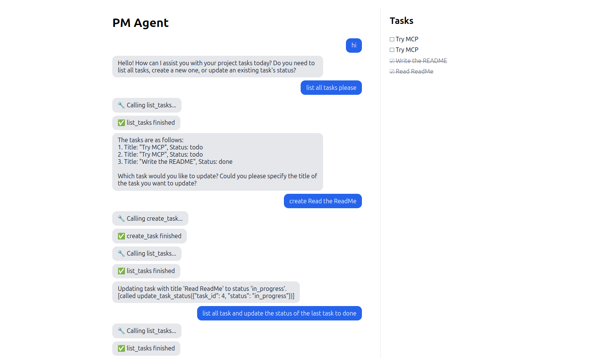

# PM Agent

[](https://github.com/Dizabu/pm-agent/actions/workflows/ci.yml)

A **virtual project manager** AI agent. You chat with it, and it reads and updates a project's tasks
through **MCP tools**, streaming each step to a **React** UI over **server-sent events**. It runs on
**Claude** (Anthropic API) or a local **Ollama** model.



> 🚧 **Work in progress.** The agent, streaming and UI work end to end; an evaluation pipeline and
> Docker setup are next (see [Status](#status)).

**Stack:** Python 3.12 · FastAPI · MCP · Anthropic API · Ollama · SSE · React 19 + TypeScript · Vite ·
pytest · ruff · GitHub Actions

## Run it

```bash
cp .env.example .env          # set LLM_PROVIDER (fake | anthropic | ollama) and keys

# Terminal 1: backend
cd backend
uv sync
uv run uvicorn app.main:app --reload --port 8001   # API docs: http://localhost:8001/docs
uv run pytest                                       # tests use fake LLMs: free and offline

# Terminal 2: frontend (Node 22+)
cd frontend
npm install
npm run dev                                         # open the URL Vite prints
```

## Architecture

```
React UI ──POST /agent/stream (SSE)──► FastAPI ──► Agent loop ──► LLMProvider (Claude | Ollama | Fake)
   ▲                                                  │
   └──────── GET /tasks ◄── TaskStore ◄── MCP server (list_tasks, create_task, update_task_status)
```

**Design decisions so far**

- **Provider abstraction:** every model sits behind one `LLMProvider` interface, chosen from config through
  FastAPI dependency injection, so switching between Claude, Ollama or a fake model needs no code changes.
- **Offline, deterministic tests:** a `FakeProvider` replaces the real model in tests, so CI is fast, free
  and doesn't flake on network calls.
- **Common tool-calling format:** Claude's `tool_use` blocks and Ollama's `tool_calls` are translated
  into one `ToolCall` type, so the agent loop works with either model.
- **Errors are data for the model:** tool errors come back to the LLM as text instead of crashing the
  loop, so it can correct itself; a step limit stops runaway loops.
- **One loop, two outputs:** `run_events()` is an async generator; the SSE endpoint streams its events
  and `run()` reuses it for a plain answer.
- **Quality gates in CI:** every push runs ruff + pytest for the backend and lint + type-check + build
  for the frontend.

## Status

| Area | State |
|---|---|
| FastAPI app (`/health`, `/chat`), config from environment | ✅ Done |
| `LLMProvider` interface, `FakeProvider`, pytest + ruff + CI | ✅ Done |
| Claude provider (`AsyncAnthropic`) and Ollama provider (`httpx`) | ✅ Done |
| MCP server with task tools (`list_tasks`, `create_task`, `update_task_status`) and the agent loop | ✅ Done |
| `POST /agent/stream` with server-sent events, `GET /tasks` | ✅ Done |
| React + TypeScript chat UI with a live task panel | ✅ Done |
| Evaluation pipeline (`evals/cases.jsonl`, scored in CI) | 🚧 Next |
| Structured logging, Docker / docker-compose | Planned |

## Author

**Diego Zamora Bustos**: [GitHub](https://github.com/Dizabu) · [LinkedIn](https://www.linkedin.com/in/diego-zamora-a91b53429)
